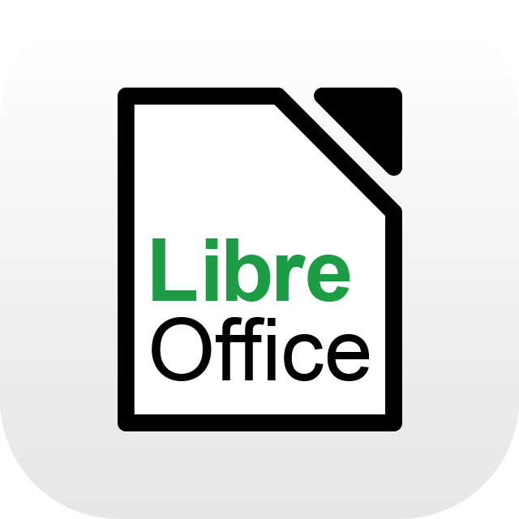
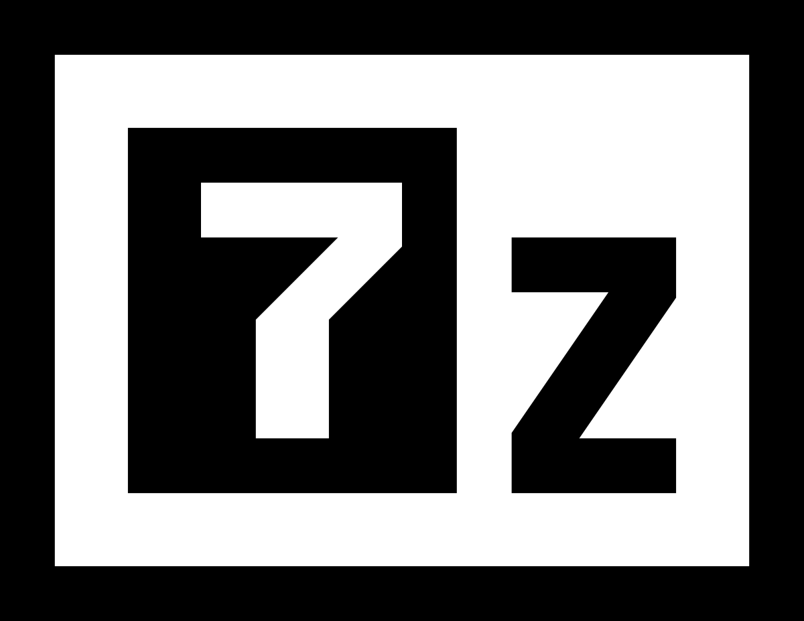

# Popy:
## Seja bem vindo ao perfil DEV do Canal POP Start. 👋
<p>2 anos como professor presencial</p>
<p>2 anos como peofessor EAD (Autonomo)</p>

### parceiros
>  🙎‍♂️ Phenrry Pereira <a href=https://www.youtube.com/@escoladephotodesign/videos>Escola de Photodesign</a><br>
>  🐸 Joy Frog
### Tecnologias Favoritas.
> Windows 
> Linux
> KDE neon
>Python 
> SQL
> Git
> OBS
> Gimp<br>
> Libre Office
> 7-Zip
> Ren'py

```py
perfil = {
   "Tecnologias Favoritas": [
      "Windows", "Linux", "SQL", "Python", "SQL",
      "Bash",
      "Git",
      "Debian",
      "Manjaro",
      "SSH",
      "Rufus",
      "Balena"
   ]
}
```

<!--
**Vinicius-PyDev/Vinicius-PyDev** is a ✨ _special_ ✨ repository because its `README.md` (this file) appears on your GitHub profile.

Here are some ideas to get you started:

- 🔭 Teste de custom
- 🌱 I’m currently learning ...
- 👯 I’m looking to collaborate on ...
- 🤔 I’m looking for help with ...
- 💬 Ask me about ...
- 📫 How to reach me: ...
- 😄 Pronouns: ...
- ⚡ Fun fact: ...
-->
