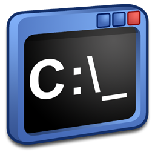

# Popy:
## Seja bem vindo ao perfil DEV do Canal POP Start. 👋
### parceiros
>  🙎‍♂️ Phenrry Pereira <a href=https://www.youtube.com/@escoladephotodesign/videos>Escola de Photodesign</a> 
>  🐸 Joy Frog
## Saber usar o Windows não significa que voce sabe usar um computador.
 Nada é mais definitivo que uma gambiarra temporaria. 

 
<!--
**Vinicius-PyDev/Vinicius-PyDev** is a ✨ _special_ ✨ repository because its `README.md` (this file) appears on your GitHub profile.

Here are some ideas to get you started:

- 🔭 Teste de custom
- 🌱 I’m currently learning ...
- 👯 I’m looking to collaborate on ...
- 🤔 I’m looking for help with ...
- 💬 Ask me about ...
- 📫 How to reach me: ...
- 😄 Pronouns: ...
- ⚡ Fun fact: ...
-->
